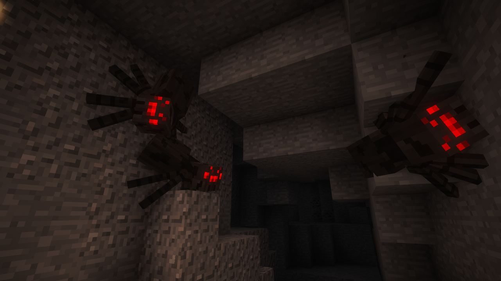

# Nimble Spiders


A Minecraft 1.7.10 backport of [Spiders 2.0](https://github.com/Nyfaria/Spiders-2.0): spiders climb walls and ceilings and find paths around obstacles. Install on both client and server.

[](https://www.curseforge.com/minecraft/mc-mods/nimble-spiders)
[](https://67.fentanylsolutions.org/mod/nimble-spiders)
[](https://github.com/JackOfNoneTrades/nimble-spiders/releases)
[](https://maven.fentanylsolutions.org/#/releases/org/fentanylsolutions/nimblespiders/NimbleSpiders)

[](https://discord.gg/xAWCqGrguG)

<!-- [](https://modrinth.com/mod/nimble-spiders) -->
<!-- [](https://www.mcmod.cn/class/PROJECT_ID.html) -->

Differences from the original mod:
* Vanilla spiders and subclasses are modified instead of entity substitution.
* Better pathfinding and behavior.
* Configurable spider fall damage protection.
* Configurable spider speed.
* LOTR spiders compat.
* AbyssalCraft Anti-Spider compat.
* Invasion Mod spiders compat.



## Dependencies

* [UniMixins](https://modrinth.com/mod/unimixins) [](https://www.curseforge.com/minecraft/mc-mods/unimixins) [](https://modrinth.com/mod/unimixins/versions) [](https://github.com/LegacyModdingMC/UniMixins/releases)

## Building

```sh
VERSION=0.1.0 ./gradlew build
```

## Credits

* Logo by @kodesque.
* TheCyberBrick for the original mod, and Nyfaria for maintaining [Spiders 2.0](https://github.com/Nyfaria/Spiders-2.0).
* [GT:NH Example Mod](https://github.com/GTNewHorizons/ExampleMod1.7.10).

## License

The code is [LGPL-2.1-or-later licensed](LICENSE), derived from LGPL-2.1-or-later code.

## Buy me some creatine

* [ko-fi.com](https://ko-fi.com/jackisasubtlejoke)
* Monero: `893tQ56jWt7czBsqAGPq8J5BDnYVCg2tvKpvwTcMY1LS79iDabopdxoUzNLEZtRTH4ewAcKLJ4DM4V41fvrJGHgeKArxwmJ`
